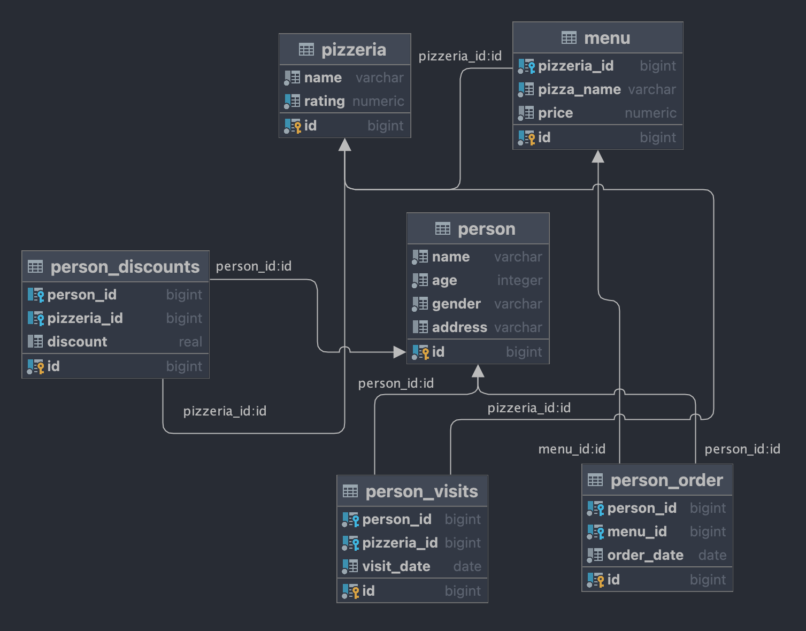
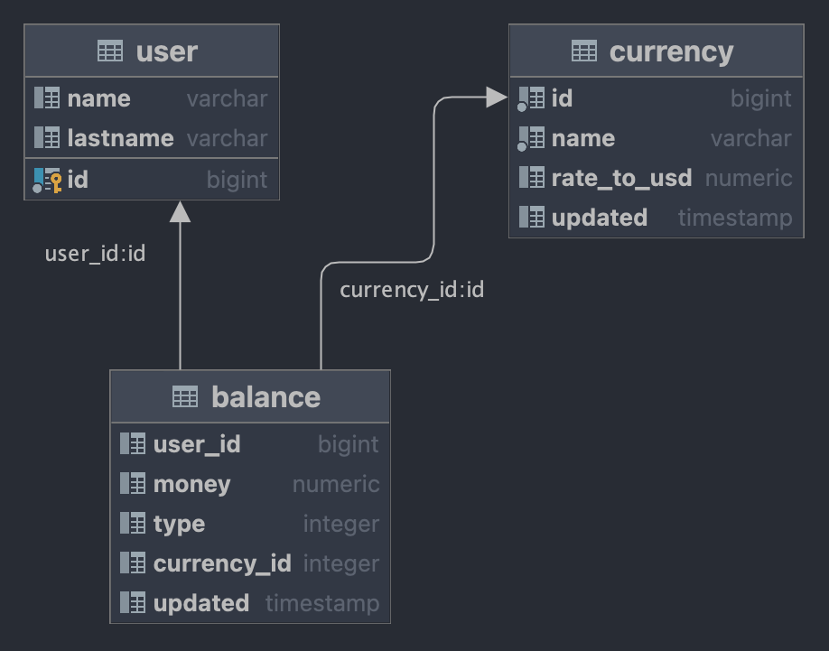

# SQL Буткемп

	

	

## 📝 Описание
SQL Буткемп в Школе21 — это введение в язык SQL и базы данных в интенсивном формате: чтобы успешно пройти Буткемп, вам необходимо ежедневно выполнять упражнения и защищать свои решения перед другими студентами.
Каждый модуль (день) в Буткемпе содержит задания, посвященные реализации SQL-запросов для извлечения необходимых данных из заданной базы данных.

Система управления базами данных, используемая в Буткемпе — <code>PostgreSQL</code>.

IDE, которую я использовал: ***VS Code + PSQL plugin***.

## 🔃 Схемы

### Основная схема базы данных

### Схема базы данных для проекта Team01

## 💻 Упражнения

***DAY00-DAY03***

Базовый синтаксис SQL: использование SELECT, JOIN, UNION и т.д.

***DAY04***

Задание посвящено виртуальным представлениям и физическим снимкам данных.

***DAY05 - DAY07***

Политики управления данными, индексы баз данных, последовательности баз данных.

***DAY08***

Транзакции и уровни изоляции.

***DAY09***

Задача дня — создать функции PostgreSQL для обработки данных.

***TEAM01***

Хранилище данных, ETL-процесс, данные с аномалиями.

ex00
